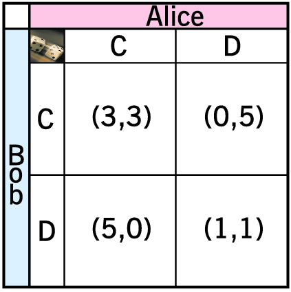

Using neural networks to do my economics homework.

Well, not really. Since learning to program semi-competently I've been going back over a number of things that would have been much cooler if I'd done them years ago when I was first doing them, but - no time like the present.

### The Case For Agents

In economics there's a difficulty: humans are very complex. We deal with this by relying on a workhorse model of utility maximising rational decision makers, and a glittering array of deviations from this model.. imperfect information, prospect theory, search costs, and on and on.

The rational model has a variety of theoretical benefits but it also has another major benefit: simplicity to calculate. This does not mean that it is simple - check out, for example the algebra underpinning this [model of the decision-making behind U.S. - Mexico migration!](https://siepr.stanford.edu/sites/default/files/publications/18-037.pdf). The issue is that game-theoretically optimal behaviour is difficult to calculate even with only a few degrees of variation. Given such complexities, it's hard to find space 

One possible solution to this, which I haven't seen talked about much (though not with the most thorough of searches!), is to try and use automatic differentiation to get around these issues and thus remove the computational complexity involved in specifying models.

The hope is that it can be used to generate optimal decision making in complex simulations where calculating algebraically in infeasible. Before we get to that, though, we need a toy example, to check that the system is operating correctly.

## Putting It Together

Start off with a classic! Prisoners' Dilemma! Here's the basic setup: 

The NN setup is so simple that it took a bit of thought to work out how to put it together - realising that I could remove the input entirely (replaced by a Tensor([1])) took a while.

The first time it all ran smoothly the agents would end up making reasonable choices in a number of setups but they wouldn't defect! Without zeroing the gradients at the beginning of each step I'd inadvenently made them completely altruistic.
[can i generate a complicated discrete scenario in which this setup in its generality is useful?]

With the bots now defecting and all fellow-feeling stamped out, I could move on to economic simulation. The first testing ground was a simple supply game: each produces an amount q1, q2 and is sold at a price of 100 - (q1 + q2).

The optimal in the simultaneous case is that they both produce 33 units of the goodand this is easily replicated through gradient descent. A trickier case to reproduce is that in which one player declares their quantity before the other. This requires the first player to consider not just the effect that their quantity has on the price but also the effect that their quantity has on the other player's decision, and how this too affects their profit.

This was a much tougher problem to solve through NNs but did result in some very pleasing graphs displaying the trajectories, and lead to some interesting differences in result when using different optimizers.
[Images of trajectories going right and wrong, and combining different optimizers).]

Up until this point, if everything else was working correctly, all the optimizers could be relied on to quickly converge to an ideal solution, learning rate no object. Now though, with convergence not guaranteed, if this system is to have reliable results then some engineering is needed. 

 
